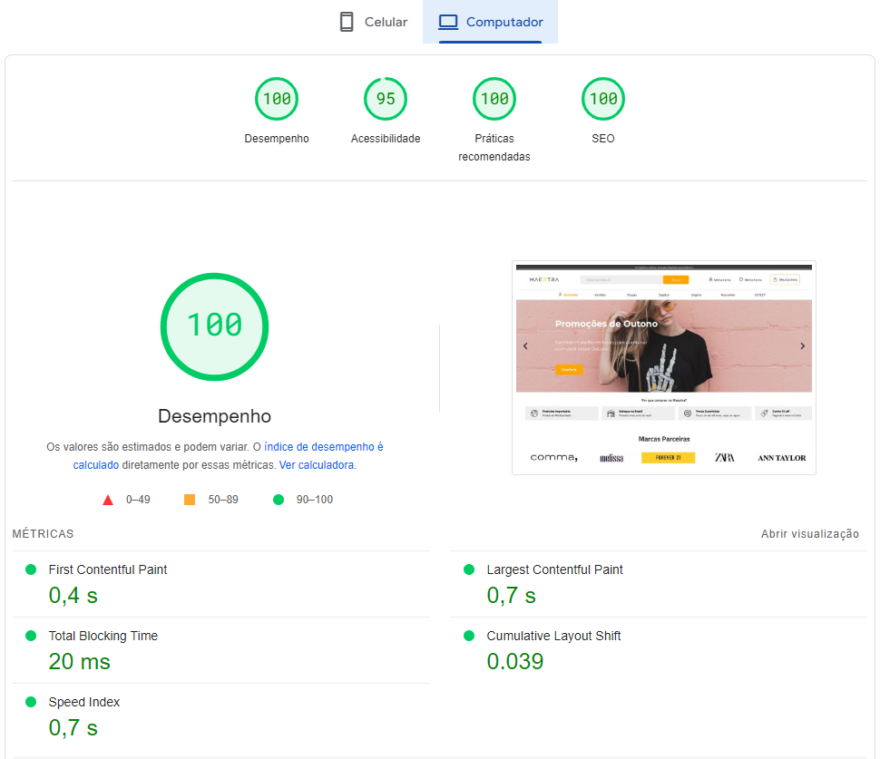

# 🔥 Desafio Maeztra Dev

## Objetivo:

      Realizar a criação do protótipo fornecido por meio da prototipagem para avaliação técnica das habilidades em Frontend.

## Requisitos:

- Criação e implementação do layout no Figma.
- Hospedar a página no Github Pages e enviar o link por e-mail.
- Estruturar o projeto em uma pasta chamada "layout" e incluir um README, se possível.
- Observação: Pode-se utilizar qualquer framework ou biblioteca de preferência.

## Prévia, teste de Core Web Vitals:

## Introdução

Ao receber o projeto, surgiram diversas ideias considerando a liberdade de escolha de frameworks ou bibliotecas. Após compreender o comportamento do GitHub Pages e realizar algumas investigações, optei por utilizar a biblioteca React, apesar de não oferecer a mesma robustez em SEO que alguns frameworks. No entanto, é excelente para a criação de componentes, o que se encaixa perfeitamente para o projeto.

### Metodologia

1. Análise Preliminar
   Verifiquei a compatibilidade das tecnologias e os requisitos para otimizar tempo e recursos.

2. Planejamento e Pesquisa
   Iniciei a coleta e otimização de recursos como imagens, arquivos, fontes e ícones, além de configurar o ambiente de desenvolvimento.

3. Desenvolvimento e Implementação
   Estruturei os componentes dentro das pastas "assets" e "components", adotando um padrão de nomenclatura e organização para facilitar a manutenção do projeto.

#### Tecnologias Utilizadas:

- React: Biblioteca principal.
- Vite: Empacotador de módulos, uma opção leve para React.
- Tailwind CSS: Biblioteca CSS ágil, baseada em classes.
- TypeScript: Linguagem tipada.
- Figma: Ferramenta de prototipagem.
- Git e GitHub: Versionamento e hospedagem do código.
- Visual Studio Code: Editor de código.
- Ferramentas para Validação:
  _ PageSpeed: Avaliação do Core Web Vitals da página.
  _ Wave: Avaliação de acessibilidade. \* Conversores de imagens para otimização de recursos.

4. Avaliação e Ajustes:

>      Realizei correções de bugs e implementei técnicas de SEO e CRO para melhorar a qualidade e eficiência do projeto.

5. Validação de Qualidade

> Realizei uma autoavaliação em busca de possíveis melhorias.

6. Apresentação e Entrega:

> O projeto está disponível neste link. Para executá-lo localmente, siga as instruções abaixo.

## Executando o Projeto Localmente:

Para executar o código em seu ambiente local, siga estas instruções:

_1°_ - Instale o NodeJS para as dependências do projeto.

_2°_ -Instale o Visual Studio Code ou um editor de sua preferência.

_3°_ -Clone este repositório para sua máquina.

_4°_ -No terminal, navegue até a pasta do projeto e execute _npm install_ para instalar as dependências.

_5°_ -Em seguida, execute _npm run dev_ para iniciar a aplicação.
Agora você pode acessar a aplicação localmente em seu navegador.

## Conclusão

O projeto foi desenvolvido seguindo uma abordagem cuidadosa, garantindo a qualidade técnica e a experiência do usuário. 

#### Espero que aproveite o projeto tanto quanto eu aproveitei desenvolvê-lo!💝 
